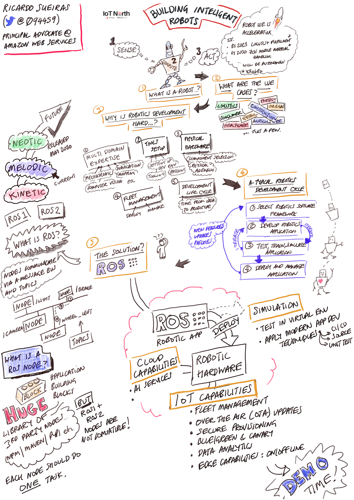

# robotics-resources

A collection of resources that I have used when talking about and showing AWS RoboMaker, ROS and how to build modern robotics.

### Talks/Presentations

### Blog Posts

This is a collection of blog posts either authored by myself or by others that talk about and dive deep into some of the things I have mentioned during my presentation.

* [Testing map generation at scale with 3D worlds from AWS WorldForge](https://aws-oss.beachgeek.co.uk/8p) - this post explores how you can get started with AWS WorldForge to generate multiple environments to better test your robotic applications. During my demos I use the code that this blog post shares.

* [Escape from the maze by training a Reinforcement Learning model on AWS RoboMaker](https://aws-oss.beachgeek.co.uk/8q) - this post takes a look at reinforcement learning and how to build a model to help solve a maze problem.

### AWS RoboMaker Workshops

* [How to Train a Robot Using Reinforcement Learning](https://aws-oss.beachgeek.co.uk/8r) - In this project, you will go through the steps to build a robotics application. This application will use reinforcement learning to train a robot (TurtleBot 3 Waffle Pi is used as an example) to drive autonomously towards a stationary robot (TurtleBot 3 Burger is used as an example). You will learn to train and evaluate the reinforcement learning model in AWS RoboMaker simulation and deploy the model to a physical robot using AWS RoboMaker fleet management.

* [Welcome Robot Builders](https://aws-oss.beachgeek.co.uk/8s) - this is a collection of three different workshops. One covers Simulation and testing of your Robotic applications, the second is a project where you use AI services to look for martians on Mars, and the final project is where you use AWS IoT to connect to ROS.

### AWS RoboMaker Demos/Projects

* [aws-robomaker-sample-application-helloworld](https://aws-oss.beachgeek.co.uk/8v) - Demonstrates the structure of ROS projects that work with AWS RoboMaker by creating a robot spinning in an empty world.
* [aws-robomaker-worldforge-mapping-evaluation-sample-app](https://aws-oss.beachgeek.co.uk/8t) - This sample application shows an example of a mapping algorithm and how we can test such an algorithm at scale using 3D Gazebo worlds generated by Worldforge feature. The application is written for ROS eco-system and has been tested on Ubuntu 18.04 system.
* [aws-robomaker-sample-application-meirorunner](https://aws-oss.beachgeek.co.uk/8u)
* [aws-robomaker-sample-application-persondetection](https://aws-oss.beachgeek.co.uk/8w) - Use AWS RoboMaker and demonstrate the use of Amazon Rekognition to recognize people's faces and Amazon Polly to synthesize speech. This project currently will not work as documented - I am working on a blog post to share how to get this up and running and will post the link here when I have done that.

### AWS-JPL

* [aws-open-source-rover-challenge](https://aws-oss.beachgeek.co.uk/92) - AWS-JPL Open Source Rover Challenge repository
* [aws-robomaker-sample-application-open-source-rover](https://aws-oss.beachgeek.co.uk/8x) - This sample application demonstrates and end-to-end robotics system with the Open Source Rover from NASA JPL. It includes a URDF file modeled after the popular open source project.
* [AWS JPL Open-Source Rover Challenge open to competitors](https://www.therobotreport.com/aws-jpl-open-source-rover-challenge-open-to-competitors/)

### AWS DeepRacer

* [aws-robomaker-sample-application-deepracer](https://aws-oss.beachgeek.co.uk/8y)
* [deepracer-for-cloud](https://aws-oss.beachgeek.co.uk/8z)
* [Distributed DeepRacer RL training with SageMaker and RoboMaker](https://aws-oss.beachgeek.co.uk/90)
* [DeepRacer notebook using Amazon SageMaker RL and AWS RoboMaker services](https://aws-oss.beachgeek.co.uk/91)

### Other useful resources

You can sign up for the weekly Robotics newsletter which has coverage of ROS topics (as well as lots of other stuff too). Head over to https://weeklyrobotics.com/ and check them out.